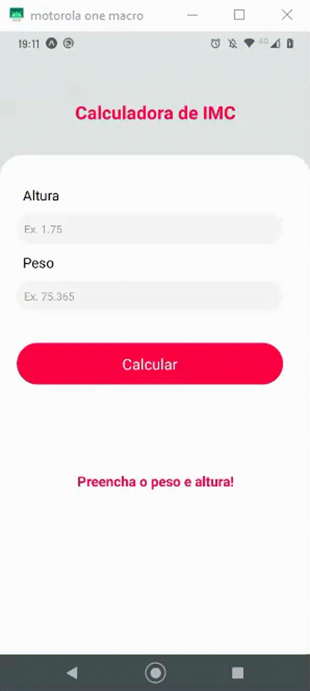

# Project
Project Calculador de IMC

Aplicativo criado em React Native, com uso da IDE VSCode + Android Studio.

1. npm start;
2. criação de funções;
3. conclusão parte lógica;
4. criação de styles;
5. estilização;
6. build;
7. conclusão;
8. Publicação.

Link para baixar o App: https://exp-shell-app-assets.s3.us-west-1.amazonaws.com/android/%40julioc43/Calcule-seu-IMC-6915a6dd3c1f4b56b10ea00eb5666d9b-signed.apk

